# Event-Driven Telecom Data Lakehouse Platform
## Architecture


## Table of Contents

- [Overview](#overview)
- [Architecture](#architecture)
- [Tech Stack and Tools](#tech-stack-and-tools)
- [Requirements](#requirements)
- [Getting Started](#getting-started)
- [Catalogs and Storage](#catalogs-and-storage)
- [Medallion Architecture Layers](#medallion-architecture-layers)
- [Silver Layer (examples)](#silver-layer-examples)
- [Gold Layer (galaxy schema)](#gold-layer-galaxy-schema)
- [Data Warehouse Model](#data-warehouse-model)
- [Orchestration](#orchestration)
- [Development Notes](#development-notes)
- [Explore the Code](#explore-the-code)


## Overview

This project implements an event-driven data lakehouse platform for telecom data processing. The platform ingests real-time telecom events (calls, SMS, payments, recharges, support tickets) through Kafka, processes them using Apache Spark, and stores them in a medallion architecture (Bronze → Silver → Gold) using Apache Iceberg. The processed data is then transformed into a dimensional model and loaded into ClickHouse for analytics and visualization with Power BI.

## Architecture

The platform follows a modern data lakehouse architecture with the following flow:

1. **Source Systems** → Produce telecom events (calls, SMS, payments, etc.)
2. **Apache Kafka** → Receives and streams events from source systems
3. **Apache NiFi** → Consumes data from Kafka and writes to MinIO
4. **MinIO** → S3-compatible object storage for raw data
5. **Apache Spark** → Transforms and validates data (orchestrated by Airflow)
6. **Apache Iceberg** → Data lakehouse storage with Bronze, Silver, and Gold layers
7. **ClickHouse** → OLAP database for dimensional model (facts and dimensions)
8. **Power BI** → Visualization and business intelligence

The architecture implements a **Medallion Architecture** pattern:
- **Bronze Layer**: Raw data ingestion from MinIO
- **Silver Layer**: Cleaned, validated, and enriched data
- **Gold Layer**: Business-ready aggregated data and dimensional models

## Tech Stack and Tools

### Core Technologies
- **Apache Spark**: Distributed data processing engine
- **Apache Kafka**: Event streaming platform
- **Apache NiFi**: Data flow orchestration
- **Apache Airflow**: Workflow orchestration and scheduling
- **Apache Iceberg**: Open table format for data lakehouse
- **ClickHouse**: Columnar OLAP database
- **MinIO**: S3-compatible object storage
- **Power BI**: Business intelligence and visualization

### Programming Languages
- **Python**: Spark jobs, data generators, and orchestration scripts
- **SQL**: Spark SQL for data transformations
- **PowerShell**: Scripts for automation and job execution

## Requirements

### Software Requirements
- Docker and Docker Compose
- Python 3.8+
- Apache Spark 3.x
- Java 11 or higher
- PowerShell (for Windows automation scripts)

### Infrastructure
- MinIO (object storage)
- ClickHouse (analytical database)
- Apache Kafka
- Apache NiFi
- Apache Airflow

## Getting Started

### Prerequisites
1. Ensure Docker is installed and running
2. Clone this repository
3. Set up environment variables if needed

### Initial Setup
1. Start all services using Docker Compose:
   ```bash
   docker-compose up -d
   ```

2. Verify all services are running:
   ```bash
   docker ps
   ```

3. Load dimension tables:
   ```powershell
   .\run_iceberg_to_clickhouse.ps1
   ```

## Catalogs and Storage

### Iceberg Catalog
- **Catalog Type**: `hadoop`
- **Warehouse Path**: `s3a://telecomlakehouse/iceberg`
- **Catalog Name**: `my_catalog`
- **Namespaces**: `bronze`, `silver`, `gold`

### Storage Configuration
- **MinIO Endpoint**: Configured for S3-compatible access
- **Access Keys**: Set via environment variables
- **Path Style Access**: Enabled for LocalStack/MinIO compatibility

## Medallion Architecture Layers

The platform implements a **Medallion Architecture** pattern with three distinct layers for data quality and processing:


### Layer Overview
- **Bronze Layer**: Raw, unprocessed data ingested from source systems
- **Silver Layer**: Cleaned, validated, and enriched data with quality checks
- **Gold Layer**: Business-ready aggregated data and dimensional models for analytics

## Silver Layer (examples)

The Silver layer contains cleaned and validated data. Examples include:

- **Validated Events**: Data quality checks applied
- **Enriched Records**: Additional metadata and validations
- **Rejection Tracking**: Records with `is_rejected` flag and `rejection_reason`

Example tables in Silver layer:
- `silver.calls`
- `silver.sms`
- `silver.payment`
- `silver.recharge`
- `silver.support`

## Gold Layer (galaxy schema)

The Gold layer implements a **galaxy schema** (also known as fact constellation schema) with:

### Data Warehouse Model Diagram

```mermaid
erDiagram
    %% Dimension Tables
    dim_date {
        string date_sk PK
        date date_value
        int year
        int month
        int day
        string day_of_week
        boolean is_weekend
    }
    
    dim_time {
        int time_sk PK
        int hour
        int minute
        int second
        string time_period
    }
    
    dim_user {
        string user_sk PK
        string user_id
        string phone_number
        string name
        string email
        string address
    }
    
    dim_device {
        string device_sk PK
        string tac
        string brand
        string model
        string os_version
    }
    
    dim_cell_site {
        string cell_sk PK
        string cell_id
        string city
        string region
        float latitude
        float longitude
    }
    
    dim_agent {
        string agent_sk PK
        string agent_id
        string name
        string department
        string email
    }
    
    %% Fact Tables
    fact_calls {
        string trasnaction_sk PK
        string date_sk FK
        int time_sk FK
        string call_id
        string event_type
        string from_phone_number
        string to_phone_number
        string from_cell_site
        string to_cell_site
        string from_imei
        string to_imei
        string from_tac
        string to_tac
        timestamp timestamp
        string status
        int call_duration_seconds
        float amount
        string currency
        string call_type
    }
    
    fact_sms {
        string trasnaction_sk PK
        string date_sk FK
        int time_sk FK
        string sms_id
        string event_type
        string from_phone_number
        string to_phone_number
        string from_imei
        string to_imei
        string from_tac
        string to_tac
        string from_cell_site
        string to_cell_site
        timestamp timestamp
        string status
        int jitter_ms
        int latency_ms
        int signal_strength_dbm
        float amount
        string currency
    }
    
    fact_payment {
        string trasnaction_sk PK
        string date_sk FK
        int time_sk FK
        string payment_id
        string event_type
        string customer_phone
        string phone_number
        string payment_type
        float payment_amount
        string payment_method
        string status
        string transaction_id
        float amount
        string currency
        string invoice_number
        float seasonal_multiplier
        timestamp timestamp
    }
    
    fact_recharge {
        string trasnaction_sk PK
        string date_sk FK
        int time_sk FK
        string transaction_id
        string event_type
        string customer
        float balance_after
        float balance_before
        float amount
        string currency
        string payment_method
        string phone_number
        timestamp timestamp
    }
    
    fact_support {
        string trasnaction_sk PK
        string date_sk FK
        int time_sk FK
        string support_id
        string event_type
        string customer_phone
        string phone_number
        string channel
        string reason
        int wait_time_seconds
        int resolution_time_seconds
        string agent_id
        int satisfaction_score
        boolean first_call_resolution
        boolean escalated
        boolean call_back_requested
        timestamp timestamp
    }
    
    %% Relationships - Conformed Dimensions (shared across all facts)
    dim_date ||--o{ fact_calls : "date_sk"
    dim_date ||--o{ fact_sms : "date_sk"
    dim_date ||--o{ fact_payment : "date_sk"
    dim_date ||--o{ fact_recharge : "date_sk"
    dim_date ||--o{ fact_support : "date_sk"
    
    dim_time ||--o{ fact_calls : "time_sk"
    dim_time ||--o{ fact_sms : "time_sk"
    dim_time ||--o{ fact_payment : "time_sk"
    dim_time ||--o{ fact_recharge : "time_sk"
    dim_time ||--o{ fact_support : "time_sk"
    
    %% Relationships - User Dimension (via phone_number lookup)
    dim_user ||--o{ fact_calls : "from_phone_number/to_phone_number"
    dim_user ||--o{ fact_sms : "from_phone_number/to_phone_number"
    dim_user ||--o{ fact_payment : "phone_number"
    dim_user ||--o{ fact_recharge : "phone_number"
    dim_user ||--o{ fact_support : "phone_number"
    
    %% Relationships - Device Dimension (via TAC lookup)
    dim_device ||--o{ fact_calls : "from_tac/to_tac"
    dim_device ||--o{ fact_sms : "from_tac/to_tac"
    
    %% Relationships - Cell Site Dimension
    dim_cell_site ||--o{ fact_calls : "from_cell_site/to_cell_site"
    dim_cell_site ||--o{ fact_sms : "from_cell_site/to_cell_site"
    
    %% Relationships - Agent Dimension
    dim_agent ||--o{ fact_support : "agent_id"
```



### Fact Tables
- `fact_calls`: Call transaction facts
- `fact_sms`: SMS transaction facts
- `fact_payment`: Payment transaction facts
- `fact_recharge`: Recharge transaction facts
- `fact_support`: Customer support interaction facts

### Dimension Tables
- `dim_user`: User/customer dimension
- `dim_device`: Device information dimension
- `dim_cell_site`: Cell tower/site dimension
- `dim_agent`: Support agent dimension
- `dim_date`: Date dimension
- `dim_time`: Time dimension

### Schema Characteristics
- Surrogate keys (MD5 hashes) for dimensions
- Date and time dimensions for temporal analysis
- Galaxy  schema patterns within the galaxy structure
- Optimized for analytical queries
- Conformed dimensions (dim_date, dim_time) shared across all fact tables

## Data Warehouse Model

The data warehouse model follows dimensional modeling principles:

### Fact Tables
Each fact table contains:
- Transaction-level metrics
- Foreign keys to dimension tables (`date_sk`, `time_sk`, etc.)
- Business measures (amounts, durations, counts)
- Transaction identifiers (`transaction_sk`)

### Dimension Tables
Dimension tables provide descriptive attributes:
- **Slowly Changing Dimensions (SCD)**: Type 1 and Type 2 support
- **Conformed Dimensions**: Shared across multiple fact tables
- **Degenerate Dimensions**: Transaction IDs embedded in facts

### Relationships
- Multiple fact tables share common dimensions (galaxy schema)
- Date and time dimensions are conformed across all facts
- User, device, and cell site dimensions are shared where applicable

## Orchestration

### Apache Airflow
Airflow orchestrates the data pipeline with DAGs for:

1. **Data Ingestion DAG**: 
   - Triggers Spark jobs to read from MinIO
   - Transforms data and writes to Iceberg Bronze layer

2. **Data Transformation DAG**:
   - Processes Bronze → Silver transformations
   - Applies data quality rules

3. **Data Modeling DAG**:
   - Orchestrates dimensional model creation
   - Loads facts and dimensions from Iceberg to ClickHouse

### Workflow Steps
1. Source systems produce data → Kafka
2. NiFi consumes from Kafka → MinIO
3. Airflow triggers Spark Job 1: Transform data → Iceberg
4. Airflow triggers Spark Job 2: Create dimensional model → ClickHouse
5. Power BI connects to ClickHouse for visualization

## Development Notes

### Code Structure
```
spark_shared/
├── Modeling/
│   ├── Dims/          # Dimension table definitions
│   │   ├── dimension.py
│   │   ├── Dim_time.py
│   │   └── ...
│   └── Fact/          # Fact table definitions
│       ├── fact.py
│       ├── Fact_calls.py
│       ├── Fact_sms.py
│       ├── Fact_payment.py
│       ├── Fact_rechage.py
│       └── Fact_support.py
├── load_dims.py       # Load dimension data from JSON
└── init.py            # Spark session initialization
```

### Key Design Decisions
- **NULL Handling**: Uses `COALESCE` to handle NULL values in fact tables
- **Timestamp Defaults**: Defaults to Unix epoch (1970-01-01) for invalid timestamps
- **Dynamic Column Detection**: Automatically detects nullable columns
- **Error Handling**: Individual try-except blocks for each fact table load

### Data Quality
- Validation rules applied in Silver layer
- Rejection tracking for invalid records
- Data type validation and casting
- Referential integrity checks

## Explore the Code

### Main Components

1. **Dimension Loading** (`spark_shared/load_dims.py`):
   - Loads dimension data from JSON files
   - Writes to Iceberg tables

2. **Fact Table Definitions** (`spark_shared/Modeling/Fact/`):
   - Each fact table has its own module
   - Contains Spark SQL queries for transformations
   - Handles joins with dimension tables

3. **Dimension Definitions** (`spark_shared/Modeling/Dims/`):
   - Dimension table generation logic
   - Time dimension generation
   - Surrogate key creation

4. **Orchestration Scripts**:
   - `run_iceberg_to_clickhouse.ps1`: Main orchestration script
   - `test_all_facts.ps1`: Testing individual fact tables
   - `show_schemas.ps1`: Schema inspection utility
